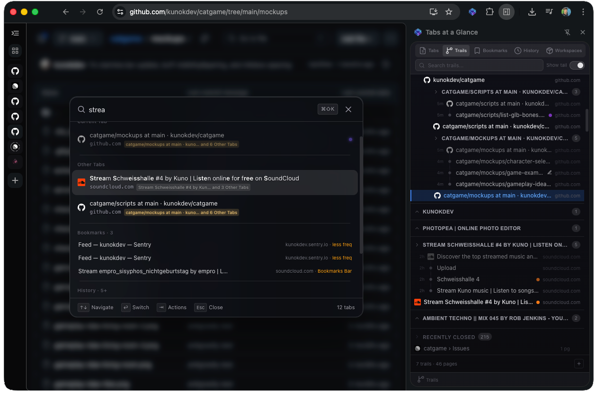
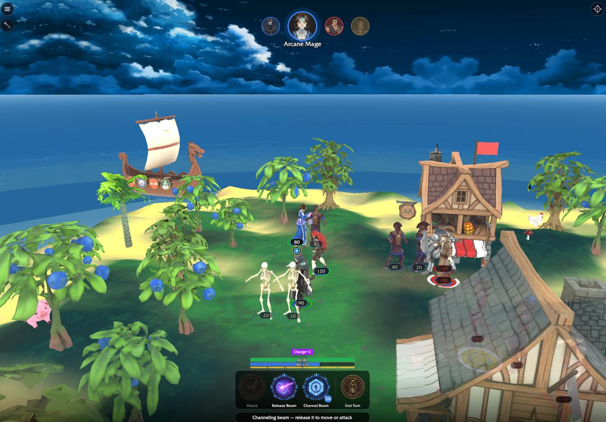

# What's Cooking?

## [Tabs at a Glance](https://glance.kunok.dev)

A keyboard-first [Chrome extension](https://chromewebstore.google.com/detail/tabs-at-a-glance/okjebgkfdmohhhcmfboinllaadldconj) for people who keep dozens of tabs open at once. It gives you Spotlight-style search across every open tab, tree-shaped trails that show how tabs branched off each other as you browse, a side panel with five different views of your tabs, a grid overlay for visually scanning everything, colored markers that flag production and staging tabs so you don't mix them up, and snapshot tools for developers. Runs entirely in your browser — no telemetry, no servers. If this project sounds interesting and you'd like to help build it, please reach out or [open an issue here](https://github.com/kunokdev/glance/issues/new?template=contribute.yml).

## Catgame

Catgame is a codename for my main side project at the moment. It is a tactical turn-based strategy RPG which tries to get some of the elements from my favorite strategy games I played as a kid and makes it mobile friendly. I've been building new unique mechanics and there's already alpha testing possible at this point.

## Vornelinks

Vornelinks is a tool which is built on top of niche, over-the-years, close-community, hand-maintained data, then processed on top of multiple data sources to construct a functionality which basically allows the user to search DJs specific to Sisyphos club in Berlin, find similar DJs based on dancefloors and track selections, preview tracks they play, and select their sets to generate a SoundCloud playlist which can then be imported into Rekordbox and mixed immediately. Useful to swiftly try different styles which are within the boundaries of the club genre. Saves months of track-collection effort.

https://github.com/user-attachments/assets/644db4ad-b45d-409a-8d9a-45f67eed7d64

## Schweisshalle 4

<table>
  <tr>
    <td width="280"></td>
    <td>Coding is great, but don't forget about the gym, for motivation use this <a href="https://soundcloud.com/kunokun/schweisshalle-4">techno set</a>.</td>
  </tr>
</table>
